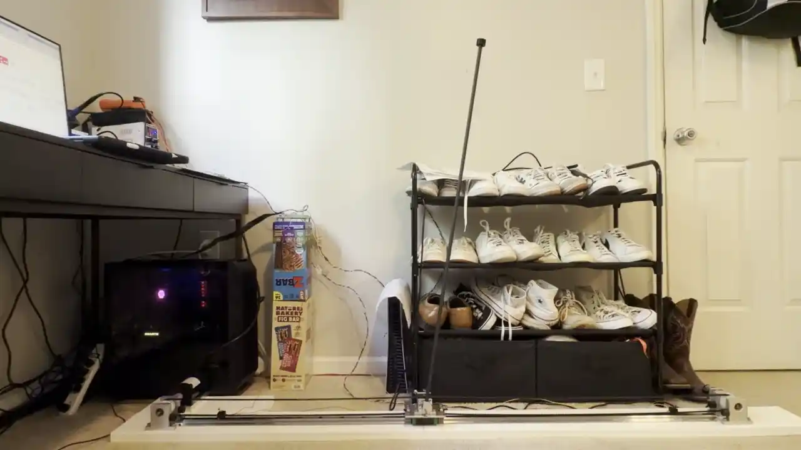
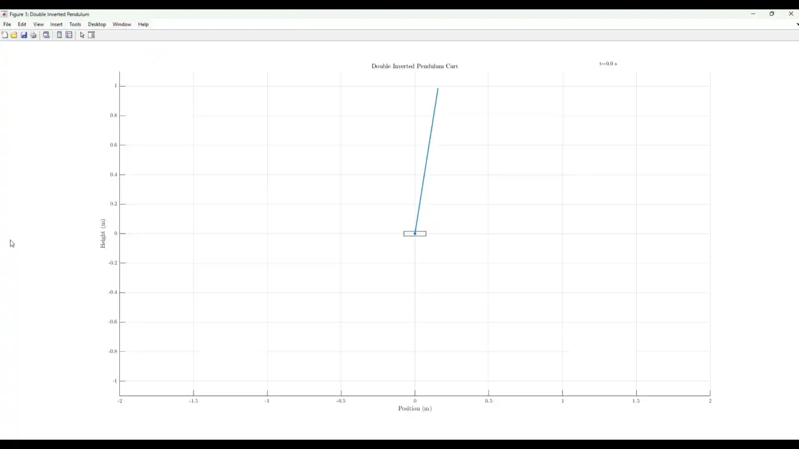
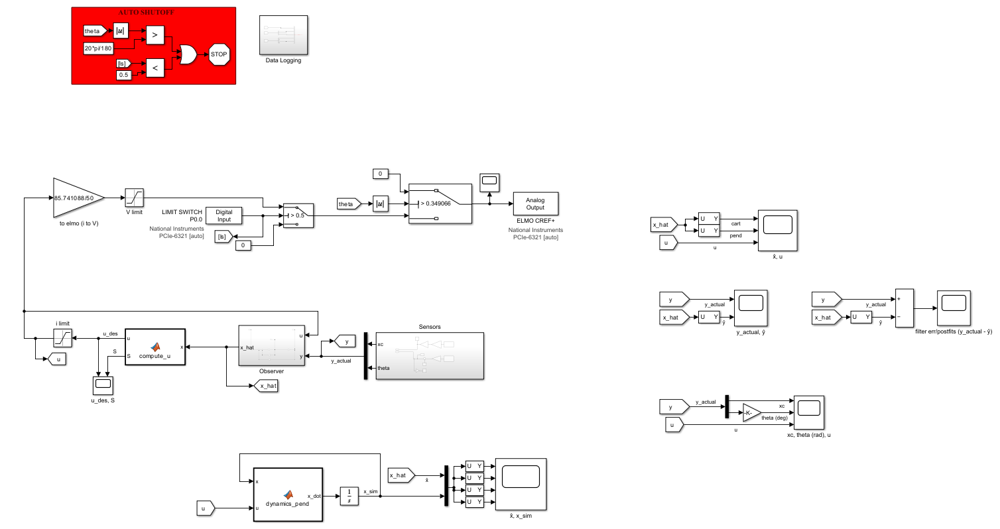
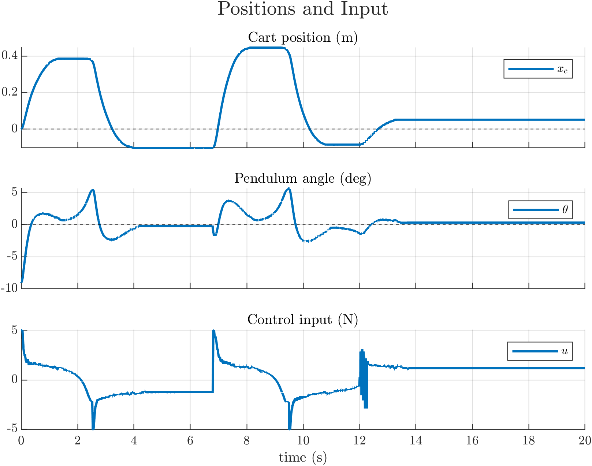
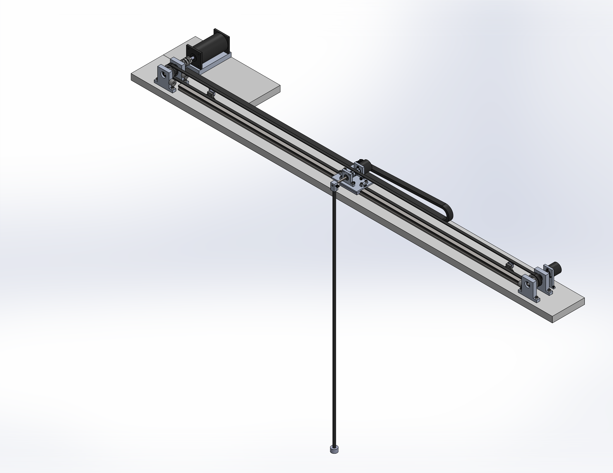

# Inverted-Pendulum-on-a-Cart
*Inverted Pendulum on a Cart implemented in MATLAB/Simulink & Simulink Desktop Real-Time.*

## Project Overview
In this project, I 

## Key Features
* **temp:** temp

## Visuals
### 1. Control System Demonstration

  
  

### 2. Simulink Control Architecture

  

### 3. Controller Performance

  

### 4. Mechanical Design
The mechanical design 

  
  

## Skills & Software Used
* **Software:** MATLAB, Simulink, Simulink Desktop Real-Time (SDRT), SolidWorks
* **Hardware:** Oscilloscope, rotary encoders, motor controllers, vertical mill
* **Concepts:** Optimal Control, Sliding Mode Control (SMC), Lagrangian Mechanics
